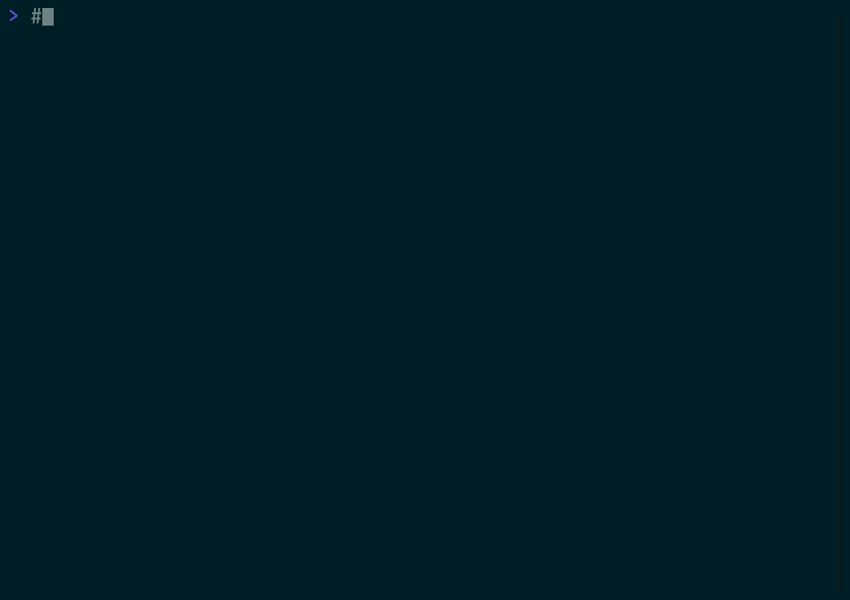
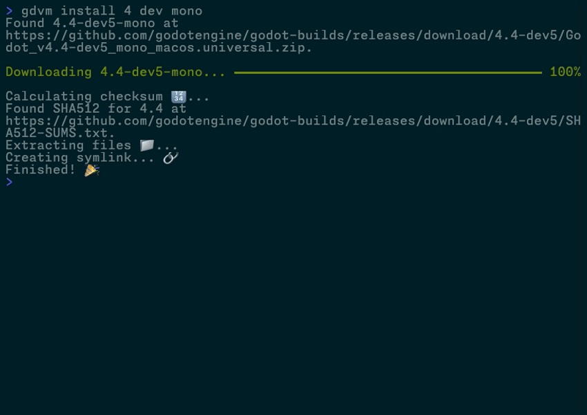

# gdvm

**gdvm**, a ***friendly*** **Godot version manager**.



## Introduction

gdvm is a friendly Godot version manager that lets users install and manage multiple versions of Godot with ease. It uses a hybrid CLI/TUI design, meaning that in certain places where it makes sense
it will prompt you to let you select what you're looking for instead of having to pass in confusing arguments, as well as support for [passing it unstructured queries](#usage) to help find the
appropriate version based on your input, like `4 dev` or `latest`. It's released as a static binary that can work on Windows, macOS, and Linux by just putting it somewhere and calling it in the
terminal, or, the preferred method of installation, using a [package manager](#package-managers).

## Features

- **Version Management**: Easily manage multiple Godot installations side-by-side, allowing you to try out the latest versions or keep older versions for compatibility testing, including Godot 1.0 to
  the latest development builds, including both standard and .NET builds.
- **Hybrid CLI/TUI Interface**: Simple command-line interface with interactive TUI prompts for easy navigation and selection when you don't specify arguments.
- **Flexible Query System**: Powerful query system for finding and installing versions using keywords like `latest`, `4 mono`, `3.3 rc`, etc.
- **Project Aware**: Lock a project to a specific Godot version using a `.gdvm-version` file in the project directory, which can be automatically detected from `project.godot` or manually customized
  if needed. Also prompts to install missing versions when opening a project that is using a version that isn't currently installed. Finally, automatically launch your project using the `godot`
  command directly from the terminal.
- **Smart Argument Handling**: Detection of arguments passed to Godot that contextually switch to an attached mode when necessary to display terminal output.
- **CI-Ready**: Perfect for remote installations, CI/CD pipelines, WSL, and containerized environments with its single static binary.

## Installation

### Package Managers

The primary way to install gdvm is through a package manager, which will make it easier to keep up to date and manage your installations:

#### Homebrew (macOS/Linux)

If you're on macOS or Linux, you can install gdvm using [Homebrew](https://brew.sh) by running the following commands:

```shell
brew tap patricktcoakley/formulae
brew install gdvm
```

Note that you may periodically need to run `brew update` if any changes are applied to the formula.

#### Scoop (Windows)

If you're on Windows, you can install gdvm using [Scoop](https://scoop.sh) by running the following commands:

```powershell
scoop bucket add patricktcoakley https://github.com/patricktcoakley/scoop-bucket
scoop install patricktcoakley/gdvm
```

### gdvmup (Currently Windows only)

There is also an **experimental** tool called `gdvmup` that can manage your installations on **Windows** using a Powershell script. I've only done preliminary testing and am open to feedback, but be
aware things there may be issues. To try it out, you can do the following:

```powershell
irm https://raw.githubusercontent.com/patricktcoakley/gdvm/main/installer.ps1 | iex
```

which will install the latest version and add gdvmup, gdvm, and the Godot alias directories to your PATH automatically. gdvmup
can handle installation, upgrade, and deletion of the gdvm tool, but it's a WIP and may change or be integrated into the main application in the future.

Usage:

- `install` [`--quiet`] [`--version VERSION`] [`--force`] installs gdvmup and gdvm, with the optional arguments for quiet output, a specific version, or forcing an installation.
- `uninstall` removes **everything**, including gdvm, gdvmup, and all Godot installations.
- `upgrade` just reinstalls everything and will likely be removed in the future unless I can think of a use case.

As of now I really only created it as a proof-of-concept but could expand it later in the future. If there is interest I will also consider a macOS/Linux version of this tool using a traditional shell
script.

### Pre-built Binaries (Windows/Linux)

If you don't want to use a package manager you can download the latest pre-built binary release from the [releases page](https://github.com/patricktcoakley/gdvm/releases).

### Build From Source

See [Build](#build) for instructions on how to build gdvm from source.

## Usage

### Getting Started

gdvm downloads and installs Godot into folders inside of `~/gdvm/` for macOS and Linux, and `C:\Users\USERNAME\gdvm\` for Windows; this might be customizable in the future.
Each installation will be in a folder with the `VERSION-TYPE-RUNTIME`. So if you installed the 4.3 stable with .NET support, it would be in a folder marked
`4.3-stable-mono`. By default, when you install a version a [symlink](https://en.wikipedia.org/wiki/Symbolic_link) is created in a folder called `bin`. This is what the `gdvm godot` command is using
by default,
or you can run `gdvm godot -i` to pick any another installation to launch, or you can simply use `gdvm set` to pick the version you want to launch by default.
This command was added to not have to rely on having your `PATH` variable set to use symlinks. You can also just drag the symlink to your taskbar or dock (depending on your OS and desktop environment)
for easy launching through icons; for macOS you would specifically use `.app`. However, if you'd like to be able to just run `godot` from the terminal directly, see [PATH](#path) for basic
instructions

Right now it supports installing whatever your computer supports by CPU and OS, so if you're running Windows on a standard x86-standard CPU you are able to install
and run versions of Godot all the way back to 1.x. macOS went through multiple architecture transitions since Godot 1 and so most modern Macs will only support releases
as far back as ~3.3, but if you have an older Mac you should still be able to install whatever it supports (should gdm itself be able to run on the system). An override to force downloads on
unsupported systems
may be added later, but it hasn't come up as a requested feature yet.

### Commands



All of this is also available in the `--help` section of the app:

```shell
gdvm --help
```

but here is a detailed summary of the available commands:

- `gdvm list`  will list locally installed Godot versions.
- `gdvm install [<...strings>]` will prompt the user to install a version if no arguments are supplied, or will
  try to find the closest matching version based on the query, defaulting to "stable" if no other release type is supplied.
  It will also set the last installed version as the default.
    - Queries:
        - `latest` or `latest standard` will install the latest stable, and `latest mono` will install the latest .NET stable.
        - `4 mono` will grab the latest stable 4.x .NET release, `3.3 rc` will grab the latest rc of 3.3 standard, `1` would take the last stable version `1`, and so on.
- `gdvm godot` runs the appropriate Godot version, or with the `--interactive` or `-i` flag, will prompt the user to launch an installed version. When run in a project directory with a `.gdvm-version`
  file, it will use that project-specific version. If no `.gdvm-version` file exists, it will use the global default version. The command will automatically detect and launch the project if a
  `project.godot` file is found.
    - Once a version is installed, it will launch the editor with the project directly from the terminal This feature will only work on projects using `config_version=5` in `project.godot`, which is *
      *Godot 4.0 and later**.
    - Optionally, pass in arguments to the Godot executable directly using the `--args` parameter, such as `gdvm godot --args --headless` or `gdvm godot --args --version`. Multiple arguments should be
      passed as a double-quoted string, such as --args "--headless -v".
    - Use the `--attached` or `-a` flag to force Godot connected to the terminal for output; by default, Godot runs in detached mode and will launch in a separate instance. Using an argument detection
      system, certain arguments (like `--version`, `--help`, `--headless`) automatically trigger this mode since they would otherwise be useless without printing to standard out.
    - The command will only read existing `.gdvm-version` files for version selection, and does not create or modify version files. Use `gdvm local` to manage `.gdvm-version` files.
- `gdvm set [--interactive|-i] [<...strings>]` prompts the user to set an installed version of Godot if no arguments are supplied, or will
  try to find the closest matching version based on the query, including release type (`stable`) and version (`4`, `4.4`), or an exact match (`4.4.1-stable-mono`). Use `-i|--interactive` to select
  from already installed versions.
- `gdvm local [--interactive|-i] [<...strings>]` sets the Godot version for the current project by creating or updating a `.gdvm-version` file in the current directory. If no `.gdvm-version` file
  exists, it will automatically detect the project version from `project.godot` and install the most recent compatible version if not already installed. If a `.gdvm-version` file already exists, it
  will use that version.
    - If a list of arguments are provided, it will find the best matching version based on the query (including runtime preferences like `mono` or `standard`) and install it if necessary.
    - Use `-i|--interactive` to force interactive selection from already installed versions instead of auto-installing.
- `gdvm which` displays the location that the current Godot symlink points to.
- `gdvm remove [<...strings>]` prompts the user to select multiple installations to delete, or optionally takes a query to filter down to specific versions to delete. If there is only one match, it
  will delete it directly. If there are multiple matches, it will prompt the user to select which ones to delete.
    - For example, if you wanted to list all of the `4.y.z` versions to remove, you could just do `gdvm remove 4` to list all of the 4 major releases. However, if remove a specific version, like
      `4.4.1-stable-mono`, it will just delete that version directly. Deleting the currently set version will unset it and you will need to set a new one.
- `gdvm logs [--level|-l <string>, --message|-m <string>]` displays all the of the logs, or optionally takes a level or message filter.
- `gdvm search [<...strings>]` takes an optional query to search all available remote versions of Godot.
    - Queries:
        - `4` would filter all 4.x releases, including "stable", "dev", etc.
        - `4.2-rc` would only list the `4.2` `rc` releases, but `4.2 rc` would list all `4.2.x` releases with the `rc` release type, including `4.2.2.-rc3`

### Project Version Management

gdvm supports project-specific version management through `.gdvm-version` files. Here's how it works:

#### Setting up a project version:

```bash
# Navigate to your project directory
cd my-godot-project

# Option 1: Auto-detect version from project.godot
gdvm local                    # Detects version from project.godot, creates .gdvm-version

# Option 2: Explicitly set a version
gdvm local 4.3 mono          # Creates .gdvm-version with 4.3-stable-mono
```

#### Using project versions:

```bash
# In a project directory with .gdvm-version file
gdvm godot                    # Uses version from .gdvm-version

# In a project directory without .gdvm-version file  
gdvm godot                    # Uses global default version

# In any directory
gdvm godot -i                 # Interactive selection from installed versions
```

#### Workflow:

1. **`gdvm local`** - Creates/updates `.gdvm-version` file for project-specific version management
2. **`gdvm godot`** - Respects `.gdvm-version` file if present, otherwise uses global default
3. **`gdvm set`** - Sets the global default version used when no `.gdvm-version` exists

### Configuration

Once you've installed gdvm, there should be a `gdvm.ini` file located inside of the root `gdvm` directory. Currently, the only supported
setting is to set a [GitHub token](https://docs.github.com/en/authentication/keeping-your-account-and-data-secure/managing-your-personal-access-tokens#creating-a-personal-access-token-classic) to
disable
rate limiting on queries and installations. In order to do so, you need to edit the `gdvm.ini` to look like the following:

```ini
# GDVM Configuration File
[github]
token = "<MY_SUPER_SECRET_TOKEN>"
```

which allows you to use `gdvm` without
the [60 requests per hour restriction](https://docs.github.com/en/rest/using-the-rest-api/rate-limits-for-the-rest-api?apiVersion=2022-11-28#primary-rate-limit-for-unauthenticated-users). There may be
other use cases in the future, but otherwise all functionality exists inside the CLI itself.

## Notes

### Windows

In order to use the symlink feature for Windows, you first need to enable [Developer Mode](https://learn.microsoft.com/en-us/windows/apps/get-started/enable-your-device-for-development).
Without it, you can still install, remove, etc, but you won't have the added benefit of having a symlink pointing to your desired version, which is what the `gdvm godot` command uses to launch Godot
directly from the terminal.

### PATH

> ***NOTE:*** If you use [gdvmup](#gdvmup-currently-windows-only), [Scoop](#scoop-windows), or [Homebrew](#homebrew-macoslinux), this is not an issue and only relates to using the zipped binaries.

There currently isn't a built-in way to add the binaries to your `PATH` right, but it's very straightforward to do if you aren't familiar. If you're on Windows, you can generally
just follow [this](https://learn.microsoft.com/en-us/previous-versions/office/developer/sharepoint-2010/ee537574(v=office.14)). Otherwise, for macOS and Linux, if you're using zsh or bash you should
be able to just open your `~/.profile` and add `export PATH="$PATH:$HOME/gdvm/bin"` and then `source ~/.profile`.

## Development

### Build

In order to build this project, you just need the .NET 9 SDK. Running `dotnet run -- <command> [args]` will let you run commands immediately, but you can also run `dotnet build -c Release` to get a
release build and just copy to a directory in your PATH:

```shell
git clone https://github.com/patricktcoakley/gdvm.git
cd gdvm
dotnet restore
dotnet build -c Release
```

### Test

```shell
dotnet test
```

### Contributing

This project uses [Conventional Commits](https://www.conventionalcommits.org/) for commit messages and [Versionize](https://github.com/versionize/versionize) for automated versioning and changelog
generation.

When making changes:

1. Use conventional commit format: `type(scope): description`.
2. Supported types: `feat`, `fix`, `docs`, `refactor`, `perf`, `test`, `chore`, `ci`, `build`.
3. The changelog is automatically generated from these commits.

Example:

```shell
git commit -m "feat(environment): Added suport for OpenBSD."
```

Also please make sure to run `dotnet format` before committing to ensure code style consistency.

## Roadmap

- Get some working e2e tests, including searching, installing, setting, launching, and removing a specific version.
- Possibly consider adding multi-select and multi-query to installations so that you could bulk-install multiple versions.
- I currently have [gdvmup](#gdvmup-currently-windows-only) for Windows, and it would make sense to port that script to bash for macOS and Linux support, allowing users to more easily install gdvm
  without having to rely on a package manager, but at the cost of extra maintenance and overhead.
